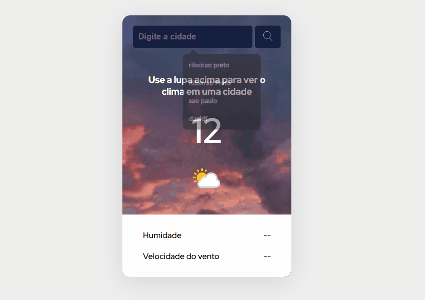

# 🌤️ Consulta de Clima por Cidade

Este é um projeto simples em JavaScript que permite ao usuário consultar as condições climáticas de qualquer cidade.

## 📌 Funcionalidades

- Busca do clima atual digitando o nome da cidade.
- Atalho com tecla **Enter** ou botão de **Busca**(Icone de Lupa).
- Exibição das informações climáticas:
  - Temperatura em Celsius
  - Condição do tempo (ex: Ensolarado, Nublado)
  - Umidade relativa do ar
  - Velocidade do vento
  - Ícone representando a condição climática

## 🛠️ Tecnologias Utilizadas

- HTML
- CSS
- JavaScript
- [WeatherAPI](https://www.weatherapi.com/) (API externa de clima)

# Demonstração de uso

